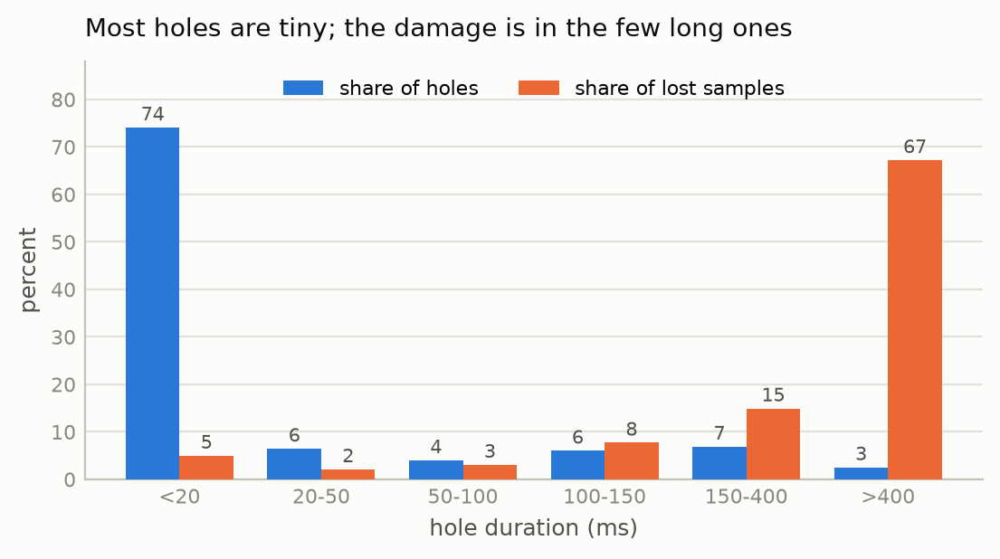
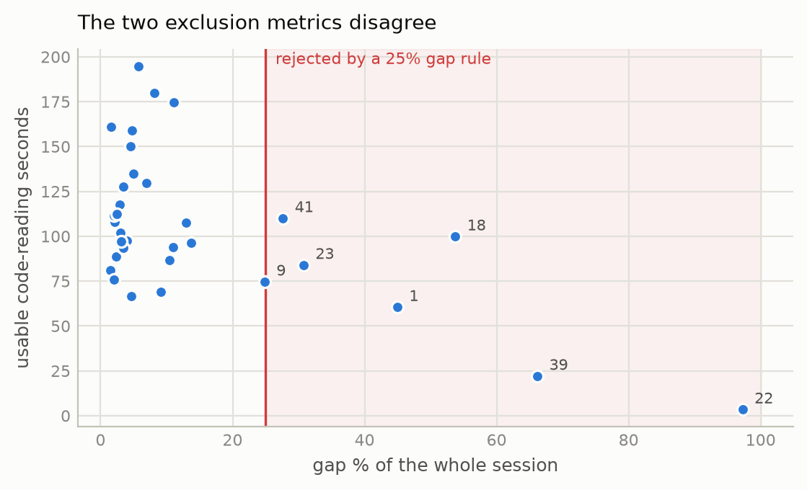
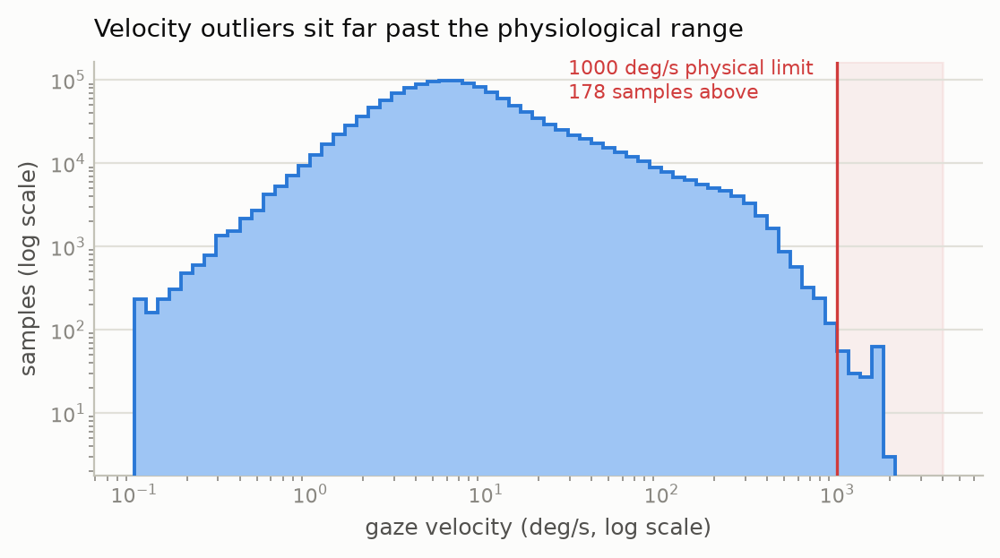
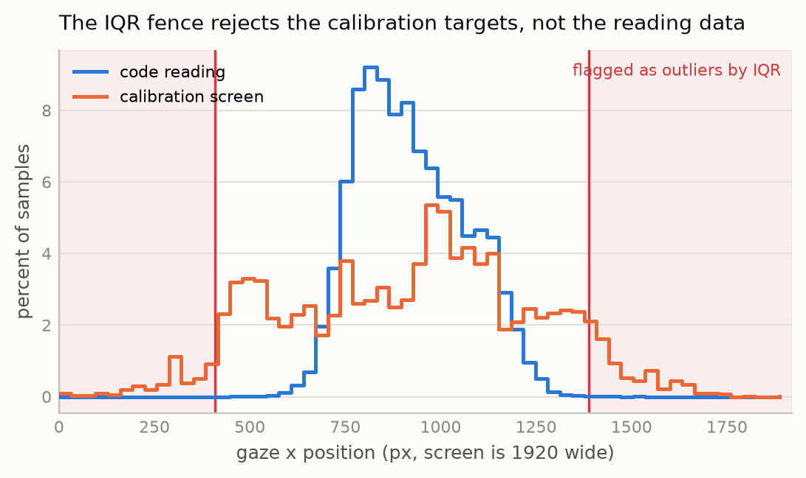
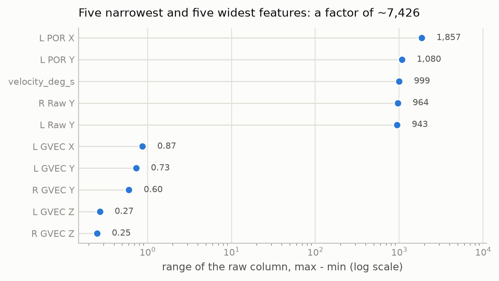
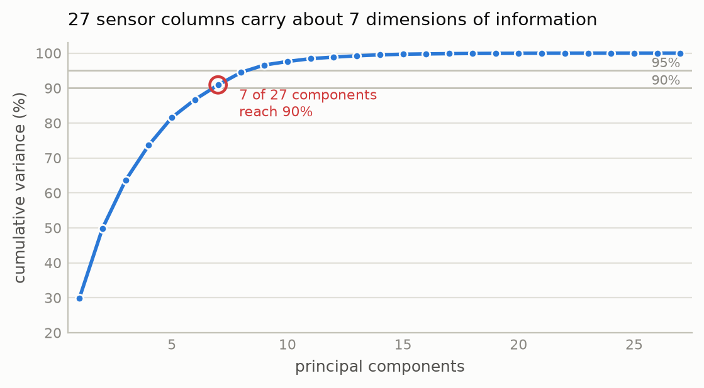

# Assignment 1: Data Preprocessing

**Eivind Systad Geiran** - IT3212 - EMIP eye-tracking dataset

Code: https://github.com/egeiran/Data-Preprocessing-EMIP (`explore.py` task 1, `cleaning.py` 2, `outliers.py` 3,
`transform.py` 4 to 6, `figures.py`).

## The dataset

The EMIP dataset [1] holds eye-tracking recordings of programmers reading two short programs
(`vehicle` and `rectangle`), each shown in one of three versions (Java, a second Java layout,
or Scala), and answering a comprehension question about each. The 33 files used
here are 250 Hz SMI RED250 recordings of 33 000 to 84 000 samples and 45 columns, each behind a
metadata header of about 30-40 lines. The rows are of two types: `SMP` measurements and `MSG`
events that mark which stimulus is on screen.

One property of the tracker drives every cleaning decision: it writes a row whether or not it
saw the eye, and when it did not, the row is all zeros. Missing data therefore arrives as zeros
that look like measurements.

## 1. Data Exploration

**Structure:** 1.71 M measurement rows and 377 messages across 33 files. `Time` and `Trial`
are `int64`, `Type` is text, and the other 42 columns are `float64` once the row types are
separated. All 33 headers state 250 Hz. Within a stimulus the largest gap between consecutive
samples is 71 ms, and three files contain a pause of up to 275 s before the first stimulus.
`explore.py` prints dtype and full statistics for all 45 columns; only the parts that drive
later decisions appear here.

**First rows** (participant 2, selected rows and columns) show the central problem in
miniature: every value is `0.0`, yet nothing is missing in any form pandas can detect.

| row | Time        | Type | L POR X | L POR Y | L Validity |
| --- | ----------- | ---- | ------- | ------- | ---------- |
| 1   | 15313372175 | SMP  | 0.0     | 0.0     | 0.0        |
| 2   | 15313376169 | SMP  | 0.0     | 0.0     | 0.0        |
| 21  | 15458834887 | MSG  | NaN     | NaN     | NaN        |
| 22  | 15458839343 | SMP  | 523.65  | 354.31  | 1.0        |

Real measurements begin after the calibration message on row 21. The `MSG` row is `NaN` in the
numeric columns because its payload is text stored in `L Raw X [px]`, which forces that column
to `object` for the whole file.

**Summary statistics** (participant 2, cleaned, n = 41 946; on raw data the sentinel zeros
make every mean and minimum meaningless):

|                          | mean   | std    | min    | median | max     |
| ------------------------ | ------ | ------ | ------ | ------ | ------- |
| `L POR X [px]`           | 899.54 | 221.62 | 351.16 | 938.53 | 1824.94 |
| `L POR Y [px]`           | 423.94 | 165.73 | 2.39   | 375.42 | 1066.10 |
| `L Mapped Diameter [mm]` | 2.90   | 0.18   | 2.54   | 2.89   | 4.37    |

Gaze centres near x = 900 on a 1920-wide screen, and pupil diameter occupies a narrow physical
band.

**Columns with no information:** `Aux1`, `L Plane`, `R Plane`, `Timing` and `Frame` hold one
unique value or none and are dropped in every file. `Trial` is also constant and is dropped in
task 4.

**Categorical columns and their unique values:** `Type` (SMP/MSG), `L Validity` and
`R Validity` (0/1), `Pupil Confidence` (0/1/2), and the message text, which is either a
stimulus image (`vehicle_java2.jpg`, `mupliple_choice_rectangle.jpg`, ...) or a
`UE-mouseclick left x=… y=…` event with coordinates inside a string.

**Redundancy:** 50 column pairs correlate above |r| = 0.95, and the reason is structural:
`Raw`, `CR`, `POR`, `EPOS` and `GVEC` are five representations of where the eye is pointing.
The extreme case is `L POR X/Y` against `R POR X/Y`, which are identical on 100 % of valid
rows in every file: the tracker fuses both eyes into one point and writes it twice. Task 4
drops the duplicates and task 6 measures how much of the rest is redundant.

**Missing data and outliers:** 18 % of raw samples are invalid and 0.012 % are physically
impossible; tasks 2 and 3 quantify both.


## 2. Data Cleaning

### What counts as missing

A sample is invalid if any of three conditions holds:

1. `L Validity == 0` or `R Validity == 0`
2. either eye's point of regard outside the 1920 × 1080 screen
3. either eye's point of regard at exactly 0

Conditions 2 and 3 catch samples the tracker itself calls valid. Condition 3 alone accounts
for 8435 samples across 32 of the 33 files, because `0.0` is the tracker's no-data sentinel
and a strict `< 0` test lets it through as a look at the screen corner. The right eye is lost
more often than the left, so `L Validity` alone understates the loss: participant 9 moves from
19 % to 41 %, participant 34 from 5 % to 16 %.

### Classifying the holes

Consecutive invalid samples are grouped into holes by run-length encoding, never across a
change of stimulus. Their durations are strongly bimodal:



*Figure 1. Hole durations. 74 % of holes are under 20 ms but cost 5 % of the
lost data; the 9 % over 150 ms cost 82 %.*

The median hole is 8 ms, two samples. A two-way blink/loss split at 150 ms counted this sensor
noise as blinking and produced peak blink rates of 26 per second, so holes are split three
ways instead:

| type      | duration     | interpretation                                                          |
| --------- | ------------ | ----------------------------------------------------------------------- |
| `dropout` | < 50 ms      | sensor noise                                                            |
| `blink`   | 50 to 400 ms | blink; [2] reports roughly 100 to 400 ms, and 50 ms is a cautious floor |
| `loss`    | > 400 ms     | track loss or looking away                                              |

For participant 2 this gives 18 blinks at a median of 122 ms, a typical blink duration,
against 347 dropouts at 4 ms.

### Handling the missing values

Mean, median and mode imputation are invalid for gaze position. The mean gaze point is a
screen location where the participant was not looking at that instant, so imputing it
fabricates a fixation. Mode imputation is meaningless for a continuous coordinate.

Holes up to 150 ms are linearly interpolated against `Time`. Gaze position typically changes
little across a short blink, so a straight line between the endpoints is a reasonable
approximation of what happened inside it. The cut-off was raised from 100 to
150 ms so that a typical blink (median 122 ms above) is filled instead of discarded; this
moves 1.42 percentage points of the average session from gap to interpolated. Blinks of 150
to 400 ms keep the `blink` label but are not filled: over 40 or more samples the endpoints
say little about the interior. The exclusion decision
below is the same for any cut-off from 100 to 250 ms.

Longer holes are kept as `NaN` and the rows deleted. Over a multi-second loss the participant
may have looked anywhere, so a straight line between the endpoints would invent data.

Interpolation runs against `Time`, not row number, and never across a stimulus change.
`interpolate(limit=n)` cannot be used: it fills the first *n* samples of every hole regardless
of length, so a 20-second loss would receive 150 ms of invented values. Each sample keeps a
`quality` label (`ok`, `interpolated`, `gap`) so later results can be traced to real data.

### Excluding participants

The obvious rule, dropping participants above some gap percentage, measures the wrong thing.
Gap % is a property of the session, including breaks, calibration and instruction screens,
while the data being modelled is code reading.



*Figure 2. The two metrics are nearly unrelated. A 25 % gap rule (shaded) would discard
participant 41, which has above-median usable data.*

Participant 41 loses 28 % of its session yet has 110 s of code reading, above the median of
100 s. Participant 1 loses 45 %, but its largest single gap is 5.1 s, which points to
spread-out blinking and not to a break. Participant 18 has 95 s on `vehicle` and 5 s on
`rectangle`, so it is missing one stimulus and is otherwise fine. Exclusion therefore operates
on (participant, stimulus) cells, keeping any with at least 20 s of usable data. That drops 6
of 66 cells where a 25 % gap rule would drop 6 whole participants: 22 and 39 lose both
stimuli, 1 and 18 lose only `rectangle`.

### Using the gaps

Where the eye was during a gap is unrecoverable, but the fact that there was a gap is
behaviour: blink rate drops sharply during reading [2], and long losses usually mean the
participant looked away. Before the gap rows are deleted, `blink_rate` and `gap_fraction` are
computed over a trailing 5 s window. The window is trailing because a per-stimulus aggregate
would encode the target.

**Result: 1 440 469 rows, 46 columns, no `NaN`. 3.7 % of the surviving rows are interpolated
(3.3 % of the raw samples).**


## 3. Handling Outliers

### Detection

**Saccade velocity:** All 33 headers give the same geometry, 1920 × 1080 px on 344 × 194 mm
at 700 mm viewing distance, so the threshold is a physical limit and can be derived:

```
px/mm = 1920/344 = 5.58 ;  1° at 700 mm = 2·700·tan(0.5°) = 12.22 mm  →  68.2 px/°
1000 °/s = 68 200 px/s = 273 px per 4 ms sample
```

Peak saccade velocity in humans is about 700 °/s [3]. The limit is set at 1000 °/s to leave
a margin for measurement noise on a 4 ms difference, and the data confirm the choice: counts
fall smoothly to 81 in the 900 to 1000 band and rise again to 101 in the 1000 to 1500 band, so
the tail past 1000 is detached from the saccade distribution. Velocity is computed as
`hypot(ΔPOR)/Δt`, grouped by (participant, segment) so no difference crosses a participant or
a stimulus change.



*Figure 3. Velocity, both axes logarithmic. Median 6.6 °/s and p99 244 °/s sit inside the
normal saccade range; the tail past the limit is detached.*

178 of 1 440 469 samples (0.012 %) exceed 1000 °/s, with a maximum of 2061 °/s.

**Pupil diameter:** Baseline pupil size differs substantially between people, so a corpus-wide
Z-score would flag everyone with naturally large pupils, and the score is computed within
participant. Both prescribed methods were applied to this column, since it is the one where
both are valid:

|                     | global IQR | per-participant IQR | per-participant \|z\| > 3 |
| ------------------- | ---------- | ------------------- | ------------------------- |
| `L Mapped Diameter` | 3.09 %     | 1.84 %              | 0.68 %                    |
| `R Mapped Diameter` | 0.88 %     | 1.95 %              | 0.85 %                    |

The global IQR disagrees between the two eyes by a factor of 3.5 while the per-participant IQR
agrees closely, which is direct evidence that mixing participants distorts the fence. Only 14
of the 16 425 Z-outliers are not also IQR outliers, so the Z set is nested inside the IQR set, as
expected when a heavy tail inflates the standard deviation while the quartiles barely move.

### Why IQR is not used on the gaze coordinates

Reading happens in the left-centre of the screen, so the coordinate distribution is a spatial
map with no tails to speak of, and Tukey's 1.5 × IQR fence lands inside the stimulus.



*Figure 4. The IQR fence on `L POR X` is [409, 1389] on a 1920-wide screen. Calibration gaze
spills past it both ways; reading gaze crosses it in 137 of 856 785 samples.*

The fence flags 14 399 samples, all inside the screen and all survivors of cleaning. On the
calibration screen IQR flags 10.7 % of samples: its targets sit deliberately at
Position(96;810), Position(1824;270) and the other corners, so IQR rejects data for being
exactly where the participant was instructed to look. Velocity flags transitions that are
physically impossible, whereas IQR on coordinates flags positions that are merely off-centre.

### Decisions

**Velocity outliers: remove.** An impossible velocity means the coordinates are wrong, and at
0.012 % deletion costs nothing. Velocity is retained as a feature.

**Pupil outliers: cap at ±3 sd within participant.** Dilation is real physiological signal and
one of the more informative columns. Deleting its extremes would delete the effect a model is
meant to detect, whereas clipping keeps the row and bounds its leverage. The Z-score sets the
bound because it is the more conservative of the two and directly interpretable. The bound is
computed per participant, so no statistic crosses the train/test boundary drawn in task 5.

**Not transform:** A log transform pulls in a long right tail. Skew is 0.82 and the range is
1.87 to 5.68 mm, a factor of three, so the distribution is only moderately skewed. A log would
compress it for no gain and cost the interpretability of a column measured in millimetres.


## 4. Data Transformation

The modelling table holds the rows where a program label is derivable, since both the code
screens and the multiple-choice screens name their program in the stimulus filename: 1 278 741
rows, minus the 3 679 multiple-choice rows of participant 39, whose code screens were excluded
in task 2 and whose language is therefore unknown. That leaves 1 275 062 rows. The target is
which program was on screen (`vehicle` / `rectangle`), 56.1 % `vehicle`.

### 4a. Encoding categorical data

| column             | values               | encoding                     | justification                                                                      |
| ------------------ | -------------------- | ---------------------------- | ---------------------------------------------------------------------------------- |
| `program` (target) | vehicle / rectangle  | label                        | binary; 0/1 is sufficient and ordering is irrelevant for a target                  |
| `Pupil Confidence` | 0 / 1 / 2            | ordinal (one integer column) | genuinely ordered; one-hot would discard the ordering the column exists to express |
| `quality`          | ok / interpolated    | binary 0/1                   | two levels, no order                                                               |
| `screen_type`      | code / choice        | one-hot                      | unordered, so integers would impose a false ranking                                |
| `language`         | java / java2 / scala | one-hot                      | unordered, 3 levels                                                                |

`drop_first=True` on the one-hot columns. The complete dummy set is perfectly collinear, since
the levels sum to 1, which distorts PCA and makes a linear model unidentifiable.

Eighteen columns are dropped:

| dropped                    | reason                                                                                               |
| -------------------------- | ---------------------------------------------------------------------------------------------------- |
| `pid`                      | the split key; as a feature it is participant identity                                               |
| `Time`                     | an absolute counter, no gaze information                                                             |
| `Type`, `Trial`            | constant; `Type` was categorical in the raw data, but cleaning removed its variance                  |
| `segment`                  | session position; stimulus order is counterbalanced 19/12, so it predicts the target 61/39 by design |
| `stimulus`                 | the target is derived from it                                                                        |
| `L Validity`, `R Validity` | a 0 survives only on interpolated rows, so together they add almost nothing beyond `quality`         |
| `R POR X`, `R POR Y`       | identical to the `L POR` pair                                                                        |
| 8 `CR` columns             | r ≈ 1.0 with `Raw`, and held the only sentinel zeros identified after cleaning (0.46 % of rows)      |

`segment` is the important one: nothing in its values reveals the leak, only knowledge of how
the experiment was run.

**32 features remain, 27 of them continuous** (46 + velocity + 3 derived − 18 dropped − target + 1 extra language dummy).

### 4b. Feature scaling



*Figure 5. Feature ranges before scaling, log axis: `L POR X` spans 1857 units and `R GVEC Z`
spans 0.25.*

Any model that measures distance or follows a gradient (kNN, SVM, k-means, neural networks,
and PCA itself) treats one unit of every feature as equivalent. With a 7400-fold spread the
pixel columns would determine every distance and the gaze-direction columns would contribute
nothing, however informative they are. That is why scaling is necessary.

Standardization is used instead of min-max because min-max is set by the two most extreme
values of a column, and several columns were never capped. Velocity is the clearest case: its
median is 6.6 °/s on a scale that reaches 1000, so Min-Max would press nearly every row into
the bottom 1 % of the range. Standardization is set by the mean and standard deviation of the
bulk, so one extreme value cannot flatten the rest. Only the 27 continuous columns are scaled:
standardizing a 0/1 dummy changes nothing usable and destroys its interpretability.

The scaler is fit on the training set only, so scaling happens after the split, the reverse
of the order in the task list. Fitting on the full dataset would put the test set's mean and
standard deviation into the training features, a form of leakage. The output is
consistent with this: training columns come out at mean 5 × 10⁻⁹ and sd 1.000, while test
columns land at mean −0.078, as expected when the scaler has not seen them.


## 5. Data Splitting

```
train   976 680 rows / 24 participants / 55.9 % vehicle
test    298 382 rows /  7 participants / 56.6 % vehicle
participant overlap: 0
```

`GroupShuffleSplit` on participant with `test_size` 0.2 and seed 42, realised as 24/7
participants (77/23) and 76.6/23.4 % of rows.

Training error measures how well a model memorised; only withheld data measures whether it
learned anything transferable. Without a test set, added complexity always appears to improve
performance, because memorising is always available, and that is overfitting. The split
prevents it in practice because model choices, such as complexity or when to stop training,
are made on the held-out score rather than the training score, so a model that has only
memorised is rejected.

A random row split would be invalid here. Samples are 4 ms apart and adjacent ones are nearly
identical, so a random split places near-duplicates of the same moment in both sets. The
model would be evaluated on data it had effectively already seen and would score
near-perfectly while learning nothing that generalises. Splitting on participant makes the
test set seven people the model has never encountered.

The class balance survives without stratifying (55.9 % against 56.6 %).

One participant saw the Scala version of the stimuli, so `language_scala` is all-zero on one
side of any group split. A level present in a single participant cannot appear in both sets,
so that version's effect is untestable.

## 6. Dimensionality Reduction (bonus)

PCA fitted on the scaled training features only, for the same leakage reason as the
scaler.



*Figure 6. Cumulative explained variance; the first component alone carries 29.9 %.*

| variance retained | components (of 27) |
| ----------------- | ------------------ |
| 90 %              | **7**              |
| 95 %              | 9                  |
| 99 %              | 13                 |

A 3.9-fold reduction at 90 % variance retained. Because the redundancy identified in task 1
is structural, the reduction is both large and safe: 27 continuous columns hold roughly seven
dimensions of information.

The cost is interpretability. `L POR X` means "gaze x in pixels", whereas PC1 is a weighted
blend of every sensor channel and means nothing physical. PCA is therefore reported, but the
original features are kept as primary so that results stay explainable.


## Individual contributions

Eivind Systad Geiran developed the original preprocessing pipeline and carried out the main analysis for Tasks 1–6.

Trym Andreas Johnsen joined later and independently reviewed and validated the transformation pipeline for Tasks 4–6. I added a separate memory-efficient validation script,
`trym_review.py`, to reproduce and verify the modelling dataset, participant-level train/test
split, feature scaling and PCA explained-variance results. I verified that there is no
participant overlap between the training and test sets and that scaling and PCA are based on training data only, avoiding information leakage from the test set in these transformations.
The validation script is not a replacement for the original pipeline.

## Personal reflection, Trym

Before beginning working on this assignment, I mainly thought of data preprocessing as cleaning missing or incorrect values. 
Reviewing the pipeline showed me that preprocessing also determines whether later machine learning results can be trusted. 
I became aware that it is also important to split and transform the data in a way that gives a fair test later. 
For example, data from the same participant should not be in both the training and test sets. 
I also learned that scaling and PCA should be fitted using only the training data, and then the same transformations should be applied to the test data. 
This prevents the test data from influencing how the training data is prepared.

## References

1. EMIP Workshop. *Distributed Collection of Eye Movement Data in Programming: Dataset*.
   https://emipws.org/dataset/ (accessed 14 September 2026)
2. Wikipedia. *Blinking*. https://en.wikipedia.org/wiki/Blinking (accessed 14 September 2026)
3. Wikipedia. *Saccade*. https://en.wikipedia.org/wiki/Saccade (accessed 14 September 2026)

## AI declaration

Claude (Anthropic) was used as an assistant: very little in tasks 1 and 2, more in tasks 3 to
6, for writing code, for the figure scripts, and for editing the report text. Every method
choice, number and interpretation was checked by the author.
